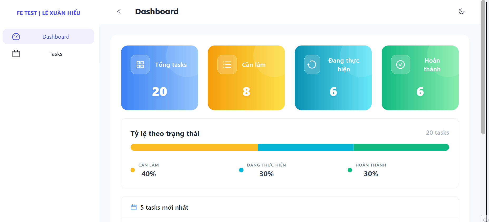

## Cài đặt và Chạy

```bash
# Clone repository
git clone https://github.com/xlehieu/fe-test-Le-Xuan-Hieu.git
cd fe-test-Le-Xuan-Hieu

# Cài đặt dependencies
npm install

# Chạy dev
npm run dev

# Build và preview luôn ạ
npm run quick-preview
```

## Tính năng

### Tính năng đã làm theo yêu cầu bài test
- **Feat dashboard**
    - Thống kê 4 thẻ Tổng task, Todo, In Progress, Done
    - Thanh Progress hoặc biểu đồ thể hiện tỷ lệ theo trạng thái
    - Danh sách 5 task được tạo gần nhất
    -   => Lấy từ taskSlice dùng createSelector, mỗi thứ có component riêng

- **Feat task**
    - Tạo Table danh sách task (component TaskList)
    - Tách component filter, làm component children trong TaskList
    - Logic của filter được dùng trong redux selector
    - Modal thêm/sửa task dùng Form có dùng generic
    - Các component select status, priority được tái sử dụng (ở filter và form)
    - Update status inline trong taskList

- **Custom hook**
    - Custom hook useOnChangeDebounce để khi onChange value, debounce xong thì gọi callback => lợi ích đỡ phải đặt thêm state, useDebounce, useEffect có dependencies là valueDebounce
    - Custom hook useTheme để lấy theme từ localstorage return về hàm toggle và isDark và add class dark vào thẻ html => Tailwind có thể dùng, ConfigProvider Antd cũng dùng


## Demo các chức năng chính


## Demo chức năng toggle dark mode
